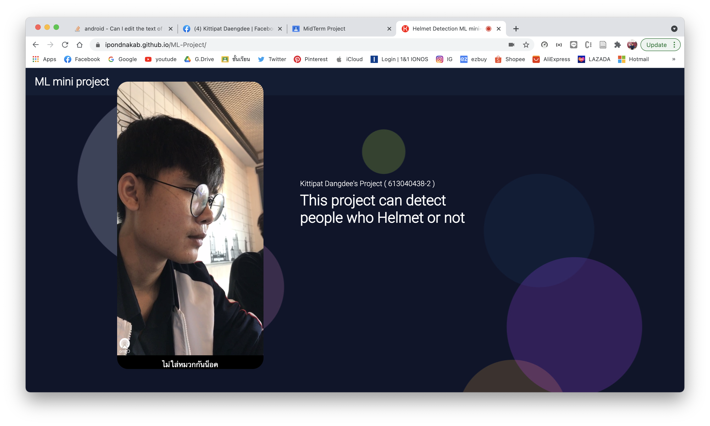
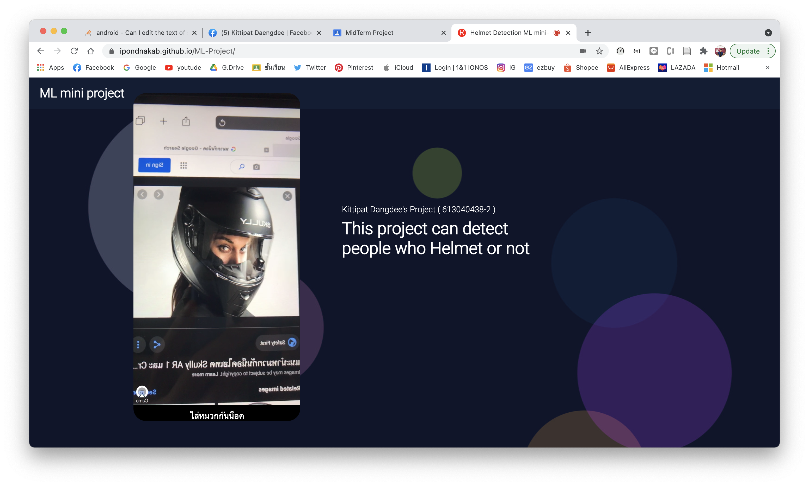

# Helmet Detect - Midterm Project
## Owner
KITTIPAT DAENGDEE 
(613040438-2)
โปรเจ็คตรวจจับการใส่หมวกกันน็อคผ่าน Matchine learning ด้วย Image หรือ Video โดยการทำงานของโปรแกรมสามารถเข้าไปดูได้ที่ [Video Demo](https://drive.google.com/file/d/10_llrSW71yxoVA6cslD3U3OHk86sBH2b/view?usp=sharing)

- [Video Demo](https://drive.google.com/file/d/10_llrSW71yxoVA6cslD3U3OHk86sBH2b/view?usp=sharing)
- [Source Code](https://github.com/ipondnakab/ML-Project)
- [Url Website](https://ipondnakab.github.io/ML-Project/)

## ภาพประกอบ Project
- ไม่ใส่หมวกกันน็อค

- ใส่หมวกกันน็อค

